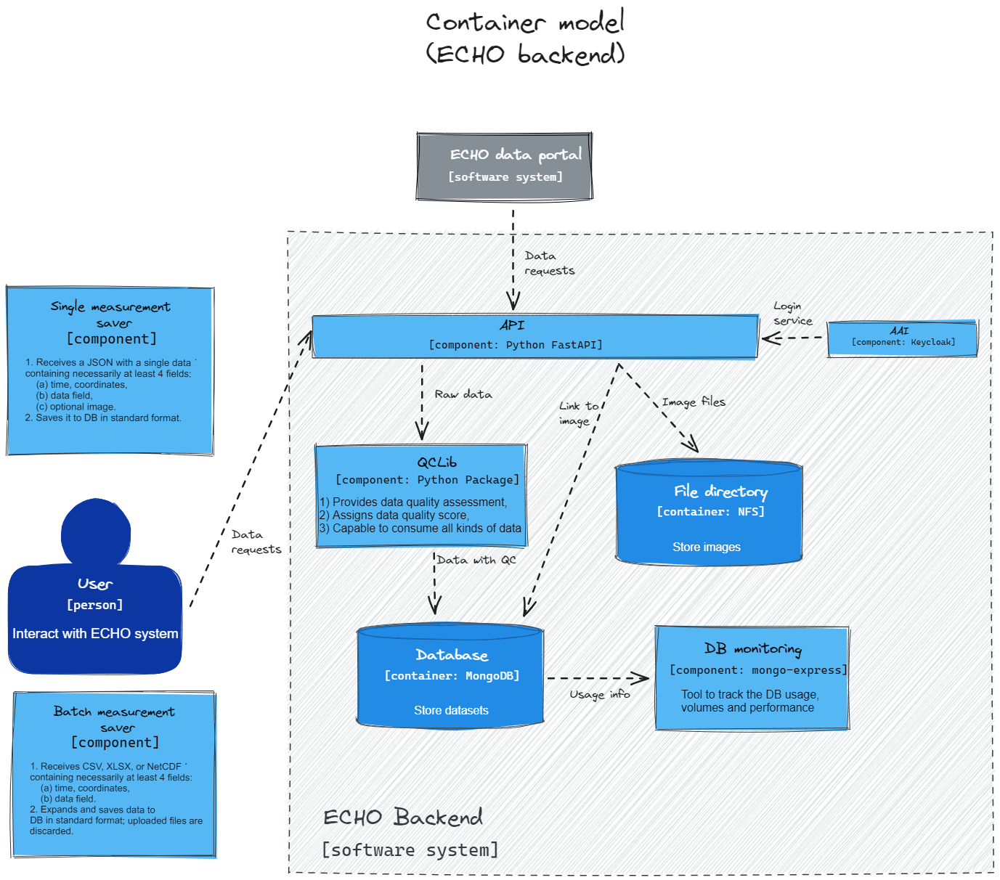

# ECHO Backend System Documentation

## Overview
The ECHO Backend is a comprehensive software system designed for data handling, storage, and interaction with various components and external systems. This documentation outlines its key components and functionalities.

### ECHO Backend Components
#### Single Measurement Saver
- **Type:** Component
- **Functionality:**
  1. Receives a JSON with a single data entry containing at least four fields:
     - Time, coordinates
     - Data field
     - Optional image
  2. Saves it to the database in a standard format.

#### Batch Measurement Saver
- **Type:** Component
- **Functionality:**
  1. Receives files in CSV, XLSX, or NetCDF formats containing at least four fields:
     - Time, coordinates
     - Data field
  2. Expands and saves data to the database in standard format; uploaded files are discarded after processing.

### Interacting Systems
#### ECHO Data Portal
- **Type:** Software System
- **Purpose:** Enables users to interact with the ECHO system.

#### EUSO Data System
- **Type:** Software System
- **Functionality:** Retrieves and sends metadata from the ECHO backend.

### Storage and Monitoring
#### Database
- **Type:** Container (MongoDB)
- **Purpose:** Stores datasets.

#### File Directory
- **Type:** Container (NFS)
- **Purpose:** Stores images.

#### DB Monitoring
- **Type:** Component (mongo-express)
- **Functionality:** Tracks database usage, volumes, and performance.

### Additional Components
#### API
- **Type:** Component
- **Purpose:** Facilitates external communication and data exchange.

#### QCLib
- **Type:** Component (Python Package)
- **Functionality:** Processes raw data and data with quality control (QC).

#### AAI
- **Type:** Component
- **Purpose:** Manages image files and links to images.

### Container Model
- The ECHO backend provides data quality assessment, assigns data quality scores, and is capable of consuming all kinds of data.

### Miscellaneous
- **Usage Information:** Details on system usage.
- **Login Service:** Manages user login and authentication.
